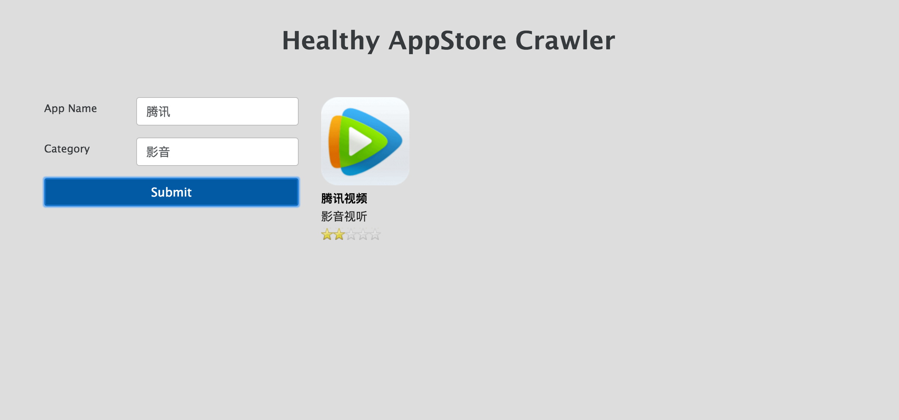
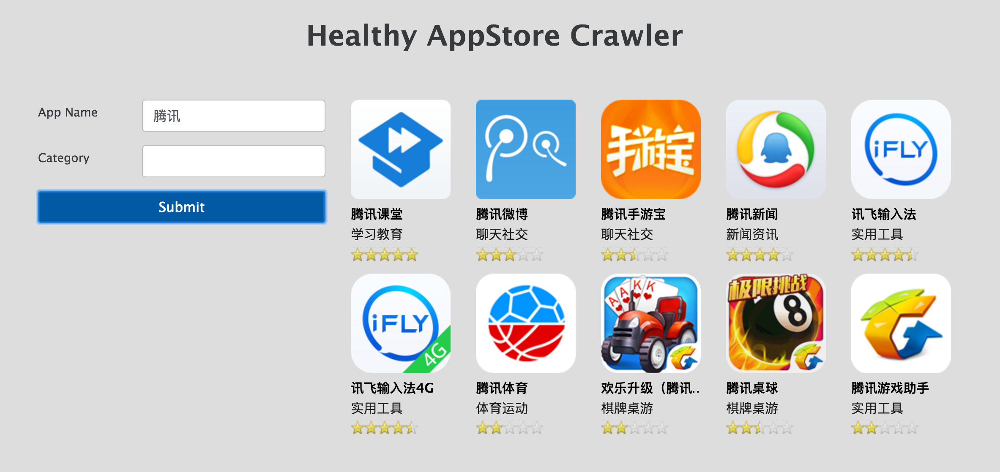

Healthy Crawler is a tool to gather all apps information from Xiaomi appstore. User could use our website to do searching according to filters. 




##Motivation
By showing the apps' information in from the search box provided by our website, user can finally understand the status of app and get the better search result the app store provided.

##Components
This project consists of two components:

A crawler to dig the app information(title, category, icon, rating, etc) from appstore.  
A webpage including back-end and front-end to provide the search-box to let user can search apps according the filters. 

##Usage
Install lastest verison of Node.JS, ElasticSearch, MongoDB  
npm install  
supervisor ./bin/www  
webpack --watch  
Test page with url localhost:3000

##Crawler

```
crawler
 |__ spider
       |__ init__.py
       |__ toplist_spider.py
 |__ init__.py
 |__ items.py
 |__ pipelines.py
 |__ settings.py
```

toplist_spider.py defines how to crawl the webpages.  
items.py defines the data fields which stored in MongoDB.  pipelines.py defines the store process in MongoDB

Run scrapy crawl toplist   

##Search Platform
We build a website to implement the searching. Node.JS for back-end and React.JS and Redux for front-end.

```
src
 |__ actions
 |__ components
 |__ containers
     |__ app_list.js
     |__ search_box.js
 |__ reducers

```
The structure of front-end follows the design rule of Redux. 

At the back-end, I use elasticsearch to do the searching. 

```javascript
Apps.search({
  query: {
    bool: {
      should: [
            { match: { title: name}},
            { match: { category: cate}}
      ]
    }        
  }
},
function(err, results) {
  if (err) {
      console.log(err);
  }
  res.send(200, JSON.stringify(results.hits.hits));
});
```
##To Do List
[ ] token in chinese searching in elasticsearch  
[ ] Frond-end design  
[ ] Optimize the scrapy in distrbuted systems and multiple IPs 

##Team Members
|[Eva](https://github.com/evah)|
|[tsi](https://github.com/appc7)|
|[Xing](https://github.com/nirvanastar)|

##Project Information
- category: full stack
- team: Healthy Web Crawler
- description: A crawler can gather all information of apps from app store and a search platform to do searching.
- stack: React, Node.js, MongoDB, ElasticSearch, Python